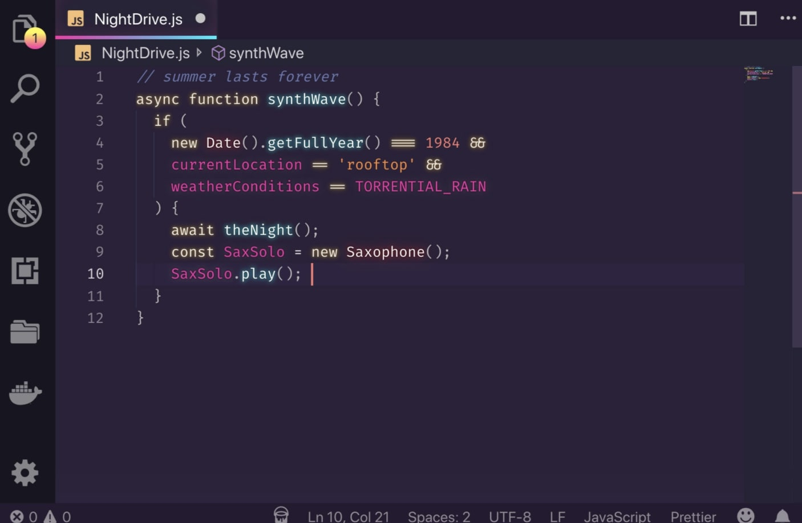
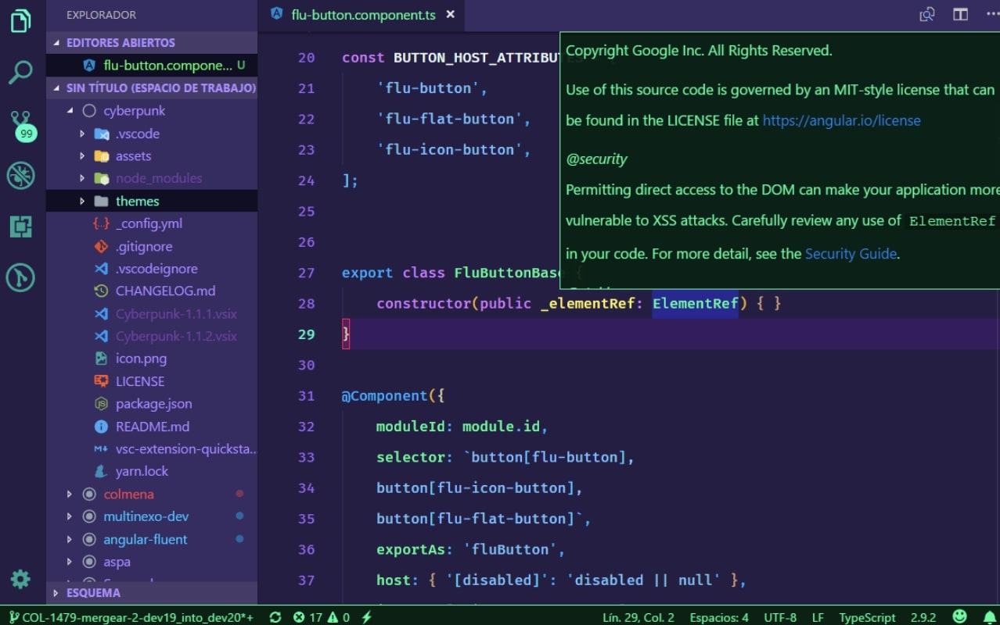
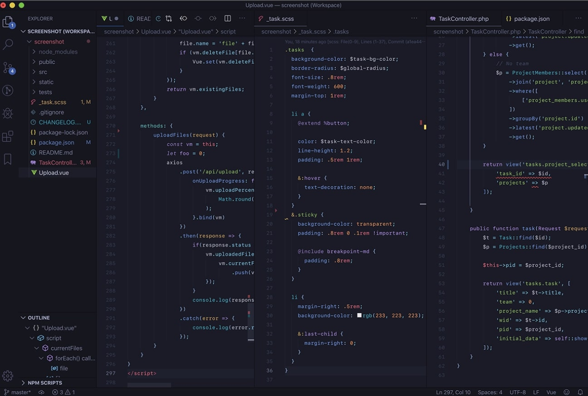

  

<h2> 1 -  SynthWave 84 </h2> 

<a href="https://marketplace.visualstudio.com/items?itemName=RobbOwen.synthwave-vscode" target="_blank" referrer="noopener norefferer">Link to theme</a> 

  
  

<h2> 2 - Cyberpunk </h2> 

<a href="https://marketplace.visualstudio.com/items?itemName=max-SS.cyberpunk" target="_blank" referrer="noopener norefferer">Link to theme</a> 
  
  

 

<h2> 3 - Tokyo Night </h2> 
<a href="https://marketplace.visualstudio.com/items?itemName=enkia.tokyo-night" target="_blank" referrer="noopener norefferer">Link to theme</a> 
  
  

