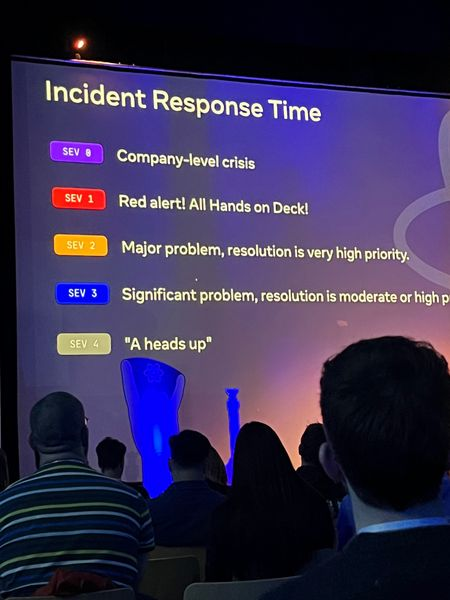

Hey, this is my first year in review. It's been a very busy year.

## Accomplishments

- Held two different titles at work and switched companies

- Finished a complete redesign of my website two times over (the one you’re using right now 😉)

- Took more holidays than I usually do and went on lots of leave

- Finished shipping a big feature at my last job before I left

- Shipping new features at my new job and learnt lots of new tech which I’m excited to improve upon in 2024

- Got started on a big side project

- Attended my first tech conference in Berlin (react-day berlin)

## goals for 2024

### Learn more things

I’m hoping to get stuck into a few big projects in order to get my teeth into some new tech and learn these subject areas in depth.

For now I’ll be focussing on:

- React native
- AWS
- Terraform / Infrastructure / DevOps
- Monitoring - New relic, Prometheus, Grafana etc.

### Write more blog posts

Hoping to write a few more blog posts than I did in 2023 particularly around things I’ve learned at work & problems I’ve faced in recent side projects and how to go about fixing them
