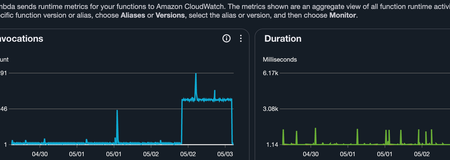
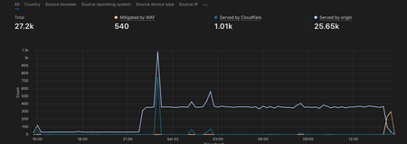
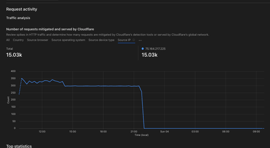
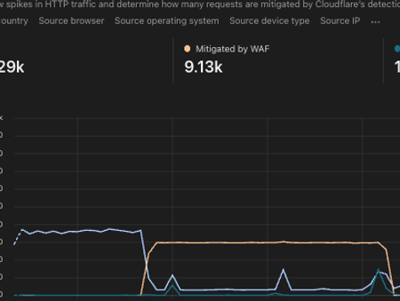

Recently I ran into an issue with one of my lambda + API Gateway services. It seemed that out of the blue an attacker decided to starting hitting my API with around 300 requests per minute. This resulted in the Lambda function being invoked around 700 times per minute. Thankfully this endpoint is cached by Cloudflare so it only resulted in around 1.5k requests being made to the upstream API that I rely on.

## Investigating the traffic spike





The first step in mitigating this attack was to find out what the attacker's IP address is. This was fairly simple in Cloudflare as I could simply navigate to the security tab, see the requests being made to my API and filter via IP address:



## Blocking the attacker in Cloudflare

The next step after identifiying the IP address is to navigate to the security rules tab and to create a rule that blocks the traffic from the offending IP address:


After this step you should notice that Cloudflare's WAF begins to block the traffic and the traffic to your origin server drops off a cliff:



## Adding API authentication with a Lambda authorizer

Now that we've succesfully mitigated the attack, let's look into how we can secure our API even further. Before the attack, my service was open to the world, the API didn't have any form of authentication such as JWT or API key. This can pose a serious issue as the attacker could switch IP address and continue flooding your service with persistent requests that don't get caught by Cloudflare (due to the relatively low volume of requests in this case).

Thankfully securing your AWS API gateway is relatively simple. Let's write a quick lambda function with the corresponding IAC code to protect our API.

```typescript title="~/apps/authorizer/src/index.ts"
/* eslint-disable prefer-destructuring, no-console */
import {
  APIGatewayRequestAuthorizerEvent,
  APIGatewayAuthorizerResult,
  StatementEffect,
} from 'aws-lambda';

export const handler = async (
  event: APIGatewayRequestAuthorizerEvent,
): Promise<APIGatewayAuthorizerResult> => {
  try {
    // eslint-disable-next-line prefer-destructuring
    const apiKey = event.headers?.['x-api-key'];

    if (apiKey !== process.env.API_KEY) {
      console.info('deny');
      return generatePolicy('user', 'Deny', event.methodArn);
    }

    console.info('allow');
    return generatePolicy('user', 'Allow', event.methodArn);
  } catch (error) {
    // eslint-disable-next-line no-console
    console.error('Error in authorizer:', error);
    return generatePolicy('user', 'Deny', event.methodArn);
  }
};

const generatePolicy = (
  principalId: string,
  effect: StatementEffect,
  resource: string,
): APIGatewayAuthorizerResult => {
  return {
    principalId,
    policyDocument: {
      Version: '2012-10-17',
      Statement: [
        {
          Action: 'execute-api:Invoke',
          Effect: effect,
          Resource: resource,
        },
      ],
    },
  };
};
```

This lambda function first checks whether there is an api-key present in the headers and if so, whether it matches the key we've provided via an environment variable / ssm store. We then have a function called `generatePolicy` which is responsible for either allowing or denying traffic to our origin API. If the API key passed in the headers matches, we forward traffic to our API as normal else we return an unauthorized response. Unless the attacker has gained informatiion on what the API key is, this will succesfully prevent the attacker from accessing the origin API.

## Deploying the authorizer with Terraform

Now that we've got our code in place, let's take a look at using Terraform to deploy this to AWS.

```hcl title="~/terraform/authorizer.tf"
data "archive_file" "auth_archive" {
  type        = "zip"
  source_dir  = "${path.module}/../apps/authorizer/dist"
  output_path = "${path.module}/../authorizer.zip"
}

resource "aws_lambda_function" "api_key_authorizer" {
  filename         = "${path.module}/../authorizer.zip"
  function_name    = "lambda-api-authorizer-${var.env}"
  role             = aws_iam_role.lambda_exec.arn
  handler          = "index.handler"
  source_code_hash = data.archive_file.auth_archive.output_base64sha256
  runtime          = "nodejs20.x"
  timeout          = 10

  environment {
    variables = {
      API_KEY = var.api_key
    }
  }

  tags = merge(var.tags, {
    Environment = var.env
  })
}

resource "aws_apigatewayv2_authorizer" "api_key" {
  api_id                            = aws_apigatewayv2_api.lambda.id
  authorizer_type                   = "REQUEST"
  authorizer_uri                    = aws_lambda_function.api_key_authorizer.invoke_arn
  identity_sources                  = ["$request.header.x-api-key"]
  name                              = "api-key-authorizer"
  authorizer_payload_format_version = "1.0"
  authorizer_result_ttl_in_seconds  = 10
}

resource "aws_lambda_permission" "api_gw_authorizer" {
  statement_id  = "AllowExecutionFromAPIGatewayAuthorizer"
  action        = "lambda:InvokeFunction"
  function_name = aws_lambda_function.api_key_authorizer.function_name
  principal     = "apigateway.amazonaws.com"
  source_arn    = "${aws_apigatewayv2_api.lambda.execution_arn}/authorizers/${aws_apigatewayv2_authorizer.api_key.id}"
}

```

Here our authorizer looks for a header with the key of `x-api-key`. We then put this authorizer in front of our api `aws_apigatewayv2_api.lambda` to validate that we're only allowing legitimate traffic.

## Protecting the API route

Now we simply hook that up to our gateway routing and our API is protected via our custom API key:

```hcl title="~/terraform/api-route.tf"
resource "aws_apigatewayv2_route" "lambda_route_hello_world" {
  api_id             = aws_apigatewayv2_api.lambda.id
  target             = "integrations/${aws_apigatewayv2_integration.lambda.id}"
  route_key          = "GET /api/hello-world"
  operation_name     = "hello-world"
  authorizer_id      = aws_apigatewayv2_authorizer.api_key.id
  authorization_type = "CUSTOM"
}
```
