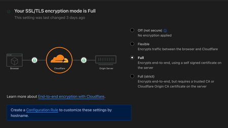
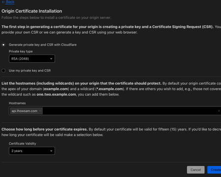
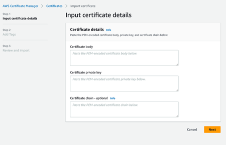
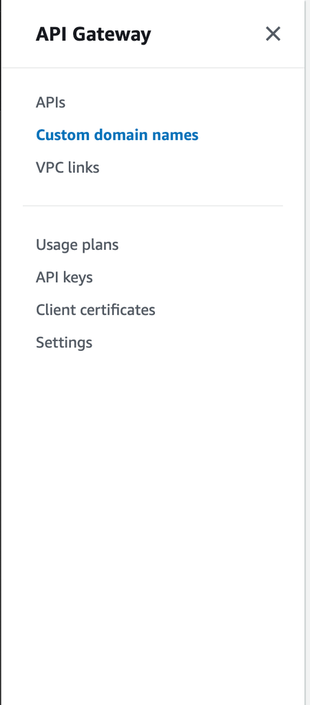
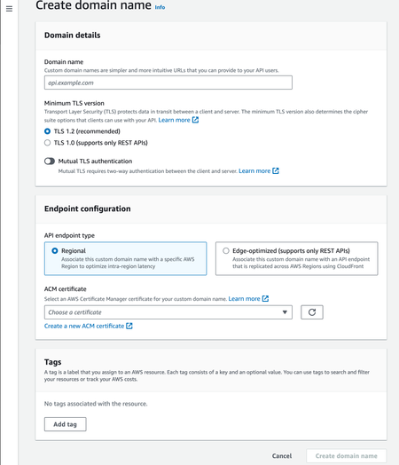
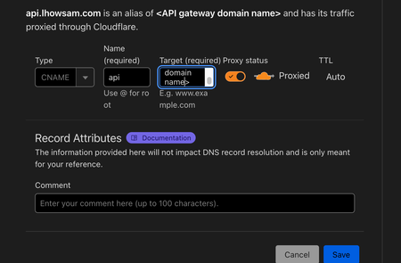

When creating lambda functions with HTTP API gateways, it's very common to not want to use the default function URL provided out the box by AWS. To achieve this, we are going to go over how to connect your domain in cloudflare to an endpoint exposed via AWS API gateway.

Steps:

- Generate an origin server certificate on cloudflare
- Import the cloudflare certificate in AWS certificate manager
- Create the custom domain name in AWS API gateway
- Create a record in cloudflare to point the record to the API gateway

## Generate a certificate on cloudflare

Navigate to the cloudflare dashboard, select the site of interest, navigate to the SSL/TLS menu and click 'Overview'. Ensure the SSL/TLS encryption mode is set to full otherwise we will get 521 errors from cloudflare.

Navigate to origin server, click 'create certificate' and enter the domain you want. This must match what you enter in 'custom domain name' in AWS API gateway.

Click create and save the origin certificate and private key somewhere safe. Ideally you should also provide AWS API gateway with the certificate chain. You can find cloudflare's certificate chain [here](https://developers.cloudflare.com/ssl/origin-configuration/origin-ca/#cloudflare-origin-ca-root-certificate)

## Import the cloudflare certificate into AWS certificate manager

Fill out the required info and click Next. Enter any tags you want and click 'review and import'. Now that we've got our certificate imported we can move on to adding the domain to the API gateway.

## Create the domain name in AWS API gateway

Go to AWS API gateway and navigate to the custom domain names section and click 'create'

Fill in the domain name with the domain you entered when creating the certificate in cloudflare and then for the ACM certificate choose the certificate you just imported.

At this point select the created domain and go to API mappings and click the Configure API mappings.

Add a new mapping selecting the API Gateway route and relevant stage.

## Point the cloudflare DNS to the API gateway

Now that everything is imported in AWS, we can go back to the cloudflare dashboard and enter our new DNS records for the gateway. Navigate to DNS and records. Click 'Add record', choose CNAME, ensure cloudflare is proxying the traffic and then enter your values. You can get the gateway domain name by navigating to API gateway > custom domain names > configurations > 'API Gateway domain name'

## Resources

View https://github.com/luke-h1/lho-lambda for an example on how to automate this infrastructure with Terraform

It's worth nothing that Cloudflare origin certificates only support one level of sub domains. So you can't have a domain such as `myapi.staging.mysite.com`
