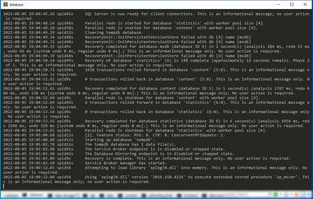
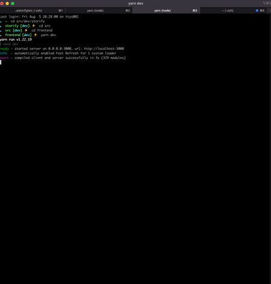

I've been recently working on a project that has over 9 projects that need to be started in order to have a fully working environment. This project consists of multiple APIs, serverless functions, 2 primary frontend apps & 1 common frontend project. Recently I've switched from using windows to mac OS for this particular project. On Windows, I use a script that opens a new terminal tab for each project. Here's a short snippet of it:

```bash
// start.cmd (example usage: '.\start.cmd')

cmd -new_console:t:"database":d:C:\Users\luke /k "cd C:\Users\luke\project\src & docker-compose up db"

cmd -new_console:t:"data-storage":d:C:\Users\luke /k "cd C:\Users\luke\project\src & docker-compose up data-storage"

cmd -new_console:t:"data":d:C:\Users\luke /k "sleep 10 & cd C:\Users\luke\project\src\api && sleep 10 && cd src/api && dotnet start"

```

This opens each project in a new tab which is great for keeping an eye on different services & for debugging.




Obviously, while this works on windows, it wasn't compatible with Mac OS.

### The solution

* Iterm2 
* AppleScript
* ZSH alias 

The above 3 combined to make the experience of starting up a complex project simple.

Here is the full script which will each sub-project in its own tab and label the tab appropriately 


```bash

#!/bin/bash
root_path="/Users/luke/the-project"

# script to open a new terminal window and start the project

osascript <<EOF
tell application "iTerm"
  set newWindow to (create window with default profile)
  tell current session of newWindow
    set name to "db"
    write text "pushd $root_path && cd src && docker-compose up db"
  end tell
  tell newWindow
    set newTab to (create tab with default profile)
    tell current session of newTab
        set name to "redis"
        write text "pushd $root_path && cd src && docker-compose up redis"
    end tell
  end tell
  tell newWindow
    set newTab to (create tab with default profile)
    tell current session of newTab
        set name to "api"
        write text "pushd $root_path && cd src/api && dotnet build && dotnet start"
    end tell
  end tell

  end tell
EOF

```




This script first tells iterm2 to open a new window with the default profile. Then we open a tab, set the tab name to whatever the project is, cd to the `root_path` specified by the script & run the command to start the project.


Now all that's left to do is to alias this script to something memorable so you can easily start your project with one command: 

```bash

echo "alias startproject='cd /Users/${whoami}/start-project.sh'" >> /Users/${whoami}/.zshrc

```
