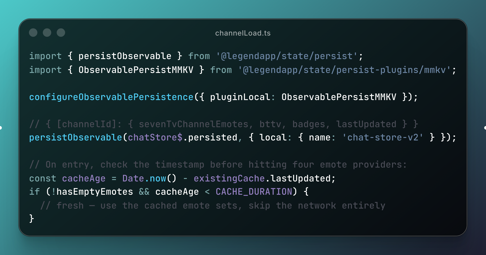
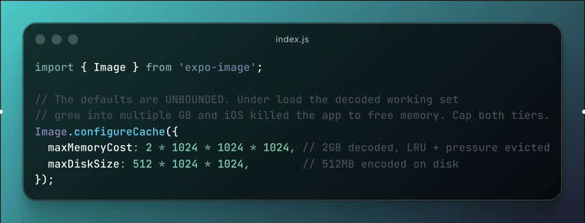
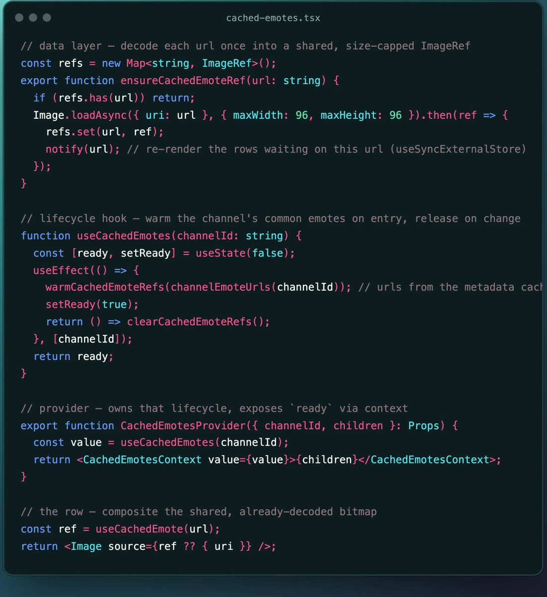
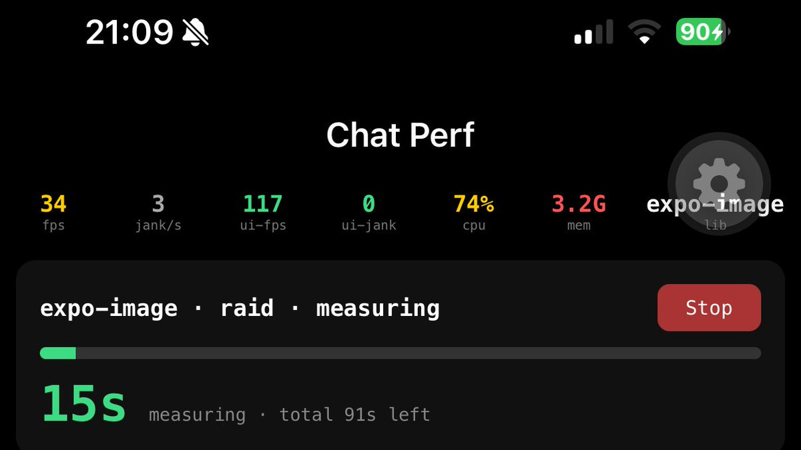
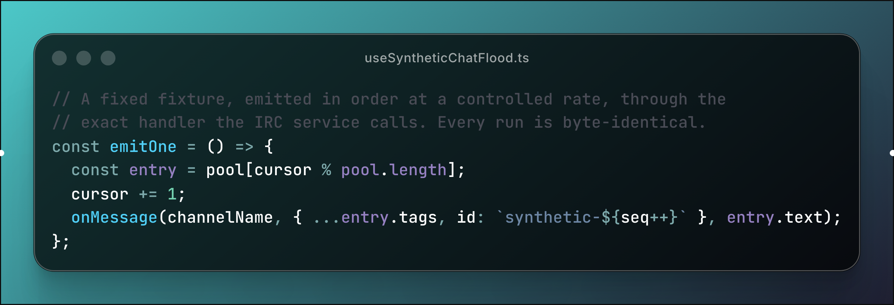
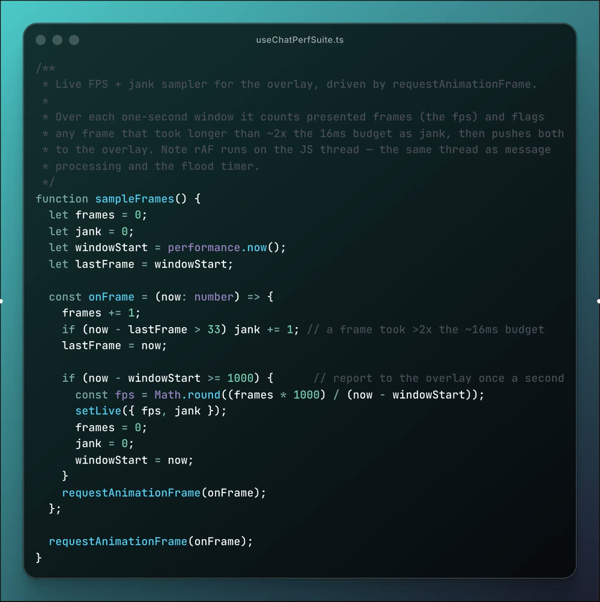
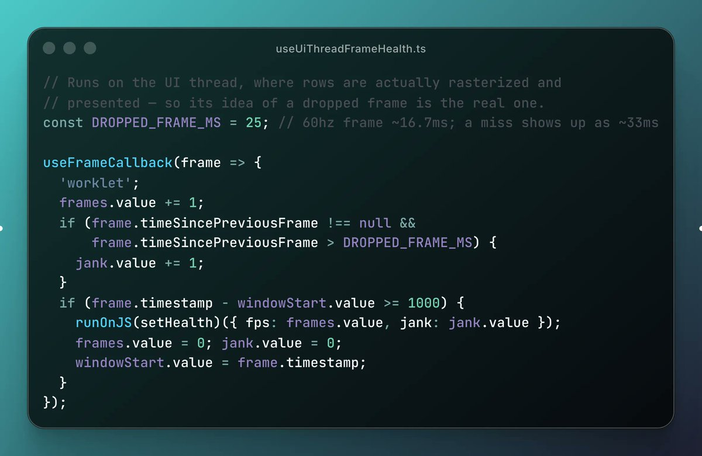
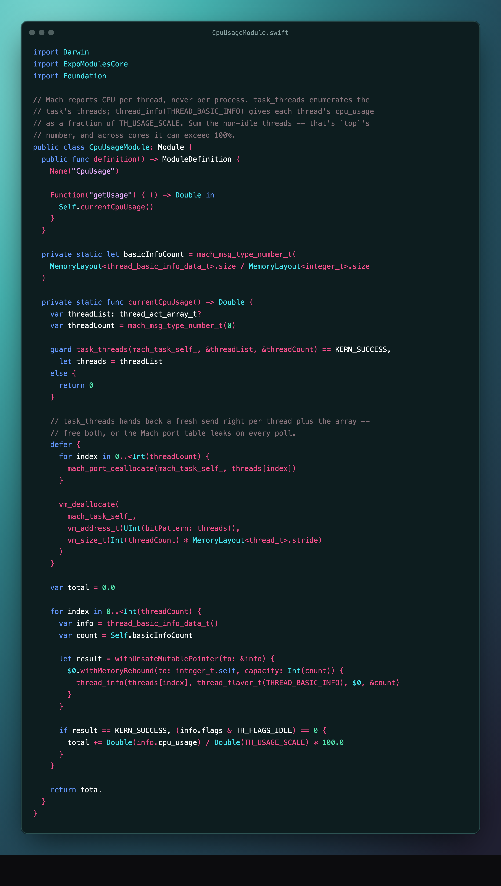
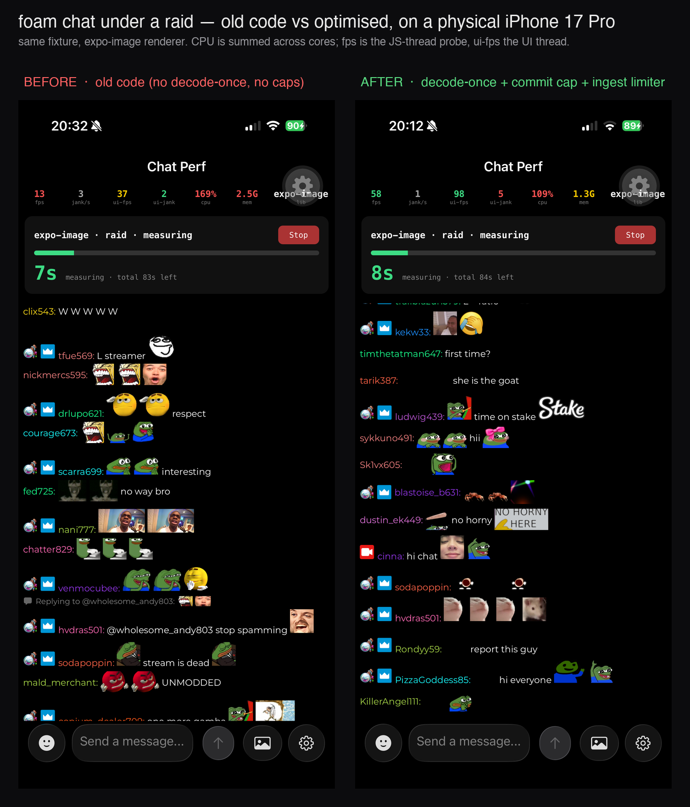
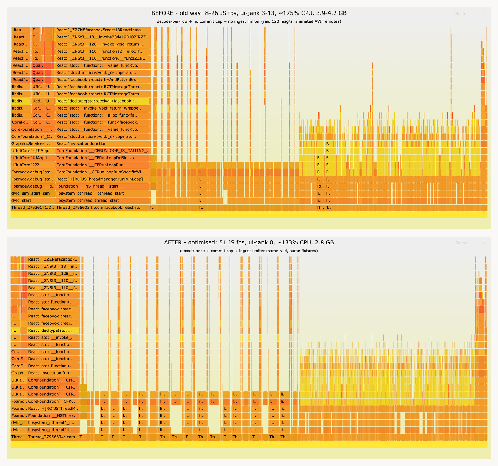

import catJamEmote from '../../assets/blog/catJAM.webp';

Live streaming apps push React Native to its limits. Video, chat, animations and network events all compete across the JS thread, UI thread and native layers. To measure and fix these problems I built an on-device benchmark, leaning on [Software Mansion](https://swmansion.com/)'s [Argent](https://github.com/software-mansion/argent) and [Callstack](http://callstack.com/)'s [agent-device](https://github.com/callstack/agent-device) to hunt the bottlenecks down. 🧵

[foam](https://github.com/luke-h1/foam) is an open-source [Twitch](https://twitch.tv) client for iOS and Android that I built with [Expo](https://expo.dev/). Twitch chat runs over IRC through a websocket, but in practice users barely type words: each message is mostly small custom animated emotes.

The area I spend most of my time making fast is a busy livestream screen with two halves: a webview (the stream itself) and the chat, which in reality is a fast-moving image feed. A popular channel pushes a steady stream of messages, at peak hundreds a second, almost every one packed with emotes, so the same little image lands in dozens of rows on screen at once and hundreds of times a minute. Sustained, that pins the CPU and grows the decoded image set until iOS starts killing the app to reclaim memory (watchdog terminations).

It's a well-trodden performance problem: a photo feed, a sticker picker, a messaging app all hit the same wall

## Before the pixels: caching the emote data

There are actually two separate caching problems here, and it's worth keeping them apart. One is the **pixels**, the decoded bitmaps, which is most of this post. The other is the **data**, the metadata that tells you which emote sets (a collection of emotes) a channel even has and where to find them.

That data is not free to get. To render a channel's chat, Foam fetches the emote sets from four separate services (Twitch, 7TV, BetterTwitchTV and FrankersFaceZ) plus the badge sets, then unifies all of it into one unified API shape. That's several API round-trips and a chunk of parsing on every single channel entry.

These are other people's CDNs. Re-fetching the metadata every time you open a channel, and then re-pulling hundreds of emote images from those CDNs every time a row scrolls into view, doesn't just make chat slow to start, it hammers the device's network and incurs extra costs for the third-party emote providers cloud bill. You saturate the network stack and pin the CPU and GPU re-downloading, re-decoding and re-uploading the same images on a loop. Sustained, that's a phone that turns into a microwave 😅. The entire point of caching here is to touch those CDNs _once_: once for the metadata, once per unique image, and then leave them alone.

Foam keeps almost all of its state in [Legend-State](https://legendapp.com/open-source/state/), an observable state library with first-class local persistence: you wrap a store in `persistObservable` and it mirrors itself to disk and rehydrates on launch, with no reducers or manual save/load. On native, that disk is [MMKV](https://github.com/mrousavy/react-native-mmkv), a memory-mapped key-value store that reads and writes synchronously and is roughly an order of magnitude faster than AsyncStorage. The emote and badge caches live in that persisted store, keyed by channel, with a timestamp check on entry so most channel opens skip the network entirely:



The TTLs are tuned to how often each thing actually changes: emotes get a day (`CACHE_DURATION = 24h`), badges get an hour (`BADGE_CACHE_DURATION = 1h`) because they churn more. A warm channel opens instantly and a cold channel will fetch the data from the CDN/APIs and cache them.

The cache is bounded the same way everything else here is: at most 20 channels, evicting the least-recently-updated and always keeping the one you're in.

## The hot and cold cache layer

This layer taught me the most painful lesson

Twitch chat is built on IRC, and IRC has no backscroll: when you join a channel you get messages from that moment on, never the ones you missed. So Foam keeps a small rolling buffer of the last messages per channel and persists it, which is what we refer to as the **recent messages** cache. This is what lets you reopen a channel (or relaunch the app) and land on a chat with historical messages (usually the last ~150 messages) instead of an empty screen while you wait for new messages to trickle in. Unlike the emote and badge caches, it's _hot_: it changes on every single message.

That recent messages cache used to live inside the same persisted observable as `channelCaches`, the emote and badge metadata from the previous section. Legend-State persists a node by serializing it, so every time a message synced, which under a busy chat is constant, it re-serialized the **entire** persisted blob, channel emote caches and all, and wrote it back to MMKV. A tiny, hot write was dragging a large, cold blob along with it on every message. It was one of the top JS hot spots in a busy channel.

The fix was to split the hot data out: recent messages now persist under their own key (`chat-recent-messages-v1`), and on native they're written per-channel rather than through Legend-State, so a sync only serializes the channel that changed.

<br />

**A hot, small write must never re-serialize a cold, large one.**

## Layer 1: Image caching

We use [expo-image](https://docs.expo.dev/versions/latest/sdk/image/) to render emotes and badges within the app. On iOS it's backed by SDWebImage, which already gives you a two-tier cache: a memory cache of decoded bitmaps and a disk cache of encoded bytes. When you render `<Image source={{ uri }} />`, a cache hit skips the network and often the decode too.

The flow on a miss is: the first time an emote is needed, expo-image fetches the encoded bytes from the CDN, writes them to the disk cache, and decodes them into the memory cache. Every later request for that URL reads from disk (and skips the CDN altogether).

The disk tier matters most for the "touch the CDN once" goal from earlier: unlike the memory cache, it survives the app being backgrounded or relaunched, so a returning user re-opens a channel and reads its emotes straight off disk instead of re-downloading them from the third-party CDNs. The memory cache keeps the hot working set fast; the disk cache keeps the whole thing off the network across sessions.

That sounds like it solves the problem and for a normal app it mostly does.

By default both tiers are **unbounded**. In a normal app that's fine, you never hold enough decoded images at once to matter. In a busy chat with a long session and a fast-moving image-heavy list, the decoded working set grew into multiple gigabytes, and iOS started killing the app to free up memory (Watchdog terminations).

So the first thing I do, before anything else renders, is bound it:



`maxMemoryCost` is the important one. It's a ceiling on the decoded bytes held in memory; past it, SDWebImage evicts least-recently-used entries, and because the memory tier sits on `NSCache`, the OS can also drop it under memory pressure. The disk cap is generous because encoded bytes are cheap and re-downloading is the expensive thing to avoid.

This has to run as early as possible: I do it in the app entry before anything else mounts so that the cache is bounded before a single image is decoded.

## Layer 2: warming the native cache

A bounded cache is still empty when you enter a channel. The first time `catJAM`  appears, you eat the full network → decode cost on the row that happens to render it, which is exactly when you don't want to.

So I warm the cache ahead of time with `prefetch`:

```ts
import { Image as ExpoImage } from 'expo-image';

// Warms expo-image's memory + disk cache, the same cache the chat rows read.
await ExpoImage.prefetch(urls, 'memory-disk');
```

On top of that I keep the warm set small and prioritized:

- Global emotes (shown in every channel) get warmed once per session, top 100.
- Channel emotes get warmed on entry, top 50, most-common emotes first.
- Only the `2x` display URLs that rows actually render, not every static and animated scale, which would multiply the network work for no benefit. Each emote also comes in a matrix of variants - every scale (1x/2x/4x) and a static vs. animated version of each. If the cache-warming step naïvely prefetched the whole matrix, it'd download maybe ~6 files per emote when
  only one (the 2x URL the rows render) is ever shown. Across the top 50–100 emotes that's hundreds of wasted downloads competing for bandwidth with the images actually on screen. So warming is deliberately narrowed to just the 2x URL which is smaller and more efficient
- Throttled into small parallel batches so warming doesn't saturate the network and starve the images you need _right now_.

The point of warming is timing. It moves the network and decode cost _before_ the user scrolls to the image, off the critical path, so neither the JS thread nor the UI thread has to do that work mid-scroll.

## Layer 3: decode once, share everywhere

Here's where the native cache stops being enough, and where I leaned on prior solutions.

Even with a warm cache, `<Image source={{ uri }} />` makes every row go through the load pipeline: look the URL up, pull the bitmap, hand it to the view. The bitmap is decoded at full source resolution, and every view that shows that emote does its own lookup. For one emote on screen this is perfectly fine. For the same emote in thirty visible rows at once, that's thirty trips through the pipeline for what is essential a tiny image.

And those rows never sit still. The chat list is [LegendList](https://github.com/LegendApp/legend-list), which doesn't mount a fresh component per message or throw old ones away; it keeps a small pool of views and rebinds them with new props as you scroll and as messages arrive in from the bottom. So the real cost was never how many messages arrive, it's what every rebind does: re-parse the message into text spans, badges and emotes, and for each emote kick off an image load, a lookup, maybe a full-resolution decode, an async resolve, a second render when the bitmap lands and a texture upload on the UI thread. Multiply that by a pool of rows recycling many times a second and the per-emote work _is_ the workload.

Software Mansion have a great project, [swm-photos](https://github.com/software-mansion-labs/swm-react-native-labs-swm-photos) that solves the equivalent problem for a Apple photos style gallery: decode each image once into a shared, display-sized reference, and hand that same reference to every view that needs it. I mirrored the pattern for chat emotes.

The primitive that makes it possible is expo-image's `ImageRef`, a handle to an already-decoded bitmap that you can render directly. The bottom of the stack is a small **data layer** with no React in it: a map of refs, a way for a row to subscribe to one URL, and the decode itself.



Two things in that `loadAsync` call are doing a lot of work.

The first is that it's **one decode per URL**, not one per row. The `refs` map means the second through thirtieth row that wants the same emote get the exact bitmap the first row decoded. That pays off on both threads: on the **JS thread**, a row whose emote is already cached mounts with a ref in hand, there's no load to kick off, no pending state, no second render when it resolves. On the **UI thread**, one texture is uploaded and then shared, instead of re-uploaded per row. Work scales with the number of _unique_ images on screen, not the number of rows.

The second is `maxWidth` / `maxHeight`, and this one is all about the UI thread. An emote's source art is often far larger than the ~30pt it renders at. Decode it at full resolution and you hold a much bigger bitmap in memory, and the part that actually drops frames, you hand the **UI thread** a much bigger texture to upload. That upload happens on the thread presenting your frames, so an oversized texture is a dropped frame. Capping the decode at 96px keeps the bitmap at the size it's drawn at, so every upload is a cheap one. `loadAsync` only ever downscales, so a small emote never goes blurry, you just stop oversized source art from costing oversized memory and oversized uploads.

And animated images still animate. The `ImageRef` carries the animation, so sharing the decode doesn't flatten an animated image into a still frame, every row playing the same emote shares one decoded, animating bitmap.

### Wiring it into React

That data layer is just a JS module, no components, no hooks. Two small React pieces (the lower half of the figure above) wire it into the tree: a provider that owns the per-channel lifecycle, and a consumer hook that subscribes each row to its own URL.

The provider is thin: it warms the channel's common emotes on entry, releases every decoded ref when the channel changes, and exposes the cache through React 19's `use()`. The consumer hook is built on `useSyncExternalStore`. The `refs` map is an external store, and a row needs to re-render exactly when its emote finishes decoding, not on every map change, just its URL's.

This matters for the JS thread. When a ref decodes, the data layer calls only the subscribers registered for that one URL so only the rows showing that emote re-render. A new emote landing doesn't reconcile the whole list, it touches only the handful of rows that asked for it.

## Lifecycle and eviction

On channel entry, I warm a **bounded common set** rather than the whole emote list. A big channel can have thousands of emotes; warming all of them in one pass would block the JS thread and decode a load of images that might never appear. So I warm the top ~96, in small sequential batches, and let the long tail decode lazily through `useCachedEmote` as those emotes actually show up:

```ts
const WARM_LIMIT = 96; // only the most common emotes are worth warming
const WARM_BATCH_SIZE = 24; // chunked so a big channel can't block the JS thread

for (let i = 0; i < urls.length; i += WARM_BATCH_SIZE) {
  await warmCachedEmoteRefs(urls.slice(i, i + WARM_BATCH_SIZE));
}
```

This is the one place I deliberately diverged from swm-photos. A photo gallery knows its whole set up front and eagerly optimizes all of it. Chat doesn't. It only ever shows the emotes that appear in messages. So warming everything is wasted work. Warm only the commonly used emotes, lazy-load the rest when required.

The other bound is on the map itself. The data layer caps the number of refs and evicts oldest-first, and the provider releases the whole map when you change channel:

```ts
const MAX_ENTRIES = 1200;

// in ensureCachedEmoteRef, before inserting:
if (refs.size >= MAX_ENTRIES) {
  refs.delete(refs.keys().next().value); // oldest insertion first
}
```

So the in-memory decoded set is bounded two ways at once: SDWebImage caps the native decoded cache by cost, and the JS-side map caps the shared refs by count. Channel hops can't grow it without bound and a never-ending stream of new images can't either.

## Putting the layers together

So the full path for an emote, top to bottom:

1. The channel's emote list and URLs come from the MMKV-persisted `channelCaches`, so most channel entries don't fetch metadata at all.
2. `useCachedEmote` asks the data layer for a shared, size-capped `ImageRef`.
3. If it's not decoded yet, `loadAsync` decodes it once at 96px and stores it; every other row showing that emote gets the same ref.
4. `loadAsync` reads through expo-image's native cache (memory first, then disk, then network), so a warm or previously-seen emote skips decode and/or download.
5. `prefetch` tried to make sure the common emotes were already warm before they appeared.
6. `configureCache` keeps the whole native decoded set under 2GB, and the ref map keeps the shared set under 1200, so none of it grows without bound.

Each layer is cheap on its own. Together they turn "render the same emote thousands of times a minute" into "decode each unique emote once and composite it everywhere," which is the only version of this that holds 60fps when the list is moving fast.

## Measuring it: a custom on-device monitor

None of the off-the-shelf profilers gave me what I wanted here: a flood of chat messages I could replay and the numbers live on the device while it was happening (so that I could test it on a real device with a production build). So I built a small benchmark that lives inside the app.



### fixture data

The first job was to stop depending on a real channel. A live chat goes very fast in a popular channel and can vary by quite a degree depending on the time of day. You can't optimise against a load you can't reproduce. So I mock the transport. The perf screen mounts the real chat component but swaps the live Twitch connection (IRC, recent-message replay, the EventSub socket) for a fixture. We replay a hand-written list of messages in order, at a controlled rate, through the exact `onMessage` handler the IRC service would call. The emote and badge loaders stay on, so the channel's real 7TV set still loads. The messages are fake but everything else is 1:1 with how the chat behaves in a real channel.



Because it's a fixed list emitted in order, every run is identical. That's the whole point: I can change one thing, replay the same flood, change it back, replay it again, and trust the difference. In the harness I call the worst-case preset [raid](https://help.twitch.tv/s/article/how-to-use-raids#howdoraidswork) after a Twitch event where a wave of viewers turns up at once from another channel

### Measuring the JS thread

With a real world, repeatable fixture I now needed a number for smoothness. The obvious one is frames per second via `requestAnimationFrame`: count how many callbacks fire in a second, flag the ones that came in late.



This nearly sent me optimising the wrong thing. Under a busy chat it read around 50fps with a handful of dropped frames a second, and nothing I did to the chat moved it. Chat already batches its commits to keep React off the JS thread's back: incoming messages land in a buffer and flush every 100ms through Legend-State, so a hundred commits a second become ten react commits. We cap how many rows commit per batch so a burst can't swamp the list. I tuned that batch size up and down and the number didn't budge, two-row batches or five, always ~50fps.

The reason is in the comment at the top of that file: `requestAnimationFrame` runs on the **JS thread**, the same thread as message processing, Hermes GC, and other expensive work. When the JS thread is saturated (which during a raid it always is) the callback fires late, and I counted that as a dropped frame, even though the JS thread isn't where frames are presented. The UI thread can sit at a steady 60fps while the JS thread struggles, and the user wouldn't be the wiser.

The fix is to measure the thread that actually presents frames. Reanimated's `useFrameCallback` runs a worklet on the **UI thread** on every frame update.



With both numbers on the overlay side by side, the picture flipped. The chat had been smooth the whole time. The JS thread was busy and worth keeping an eye on, but the UI thread, the one the user actually feels, was fine. I'd spent a day optimising against a number that came from the wrong thread.

### CPU and memory

I added two more readings to the overlay: how hard the CPU was working, and how much memory the flood was causing. Memory was easy, react-native-device-info's `getUsedMemory` gives you the process footprint. CPU needed a small native module, because Mach reports CPU per thread, not per process. The module asks `task_threads` for the thread list, reads each thread's usage through `thread_info(THREAD_BASIC_INFO)`, and sums the non-idle ones, which is the same number `top` in Linux reports and can read above 100% across cores.



### The results

To get numbers I could trust, I ran the same `raid` replay against the old code and the optimised path on a physical iPhone 17 Pro, with [Callstack's agent-device](https://github.com/callstackincubator/agent-device) driving the identical run against each build. Old code on the left, optimised on the right:



Those are instantaneous readings, and under the old code the overlay lurches: the JS-thread probe drops to 13fps, even the UI thread dipping to 37. The optimised path holds near the top. Averaged across the measured window:

| Metric (expo-image, raid) | Before (old caching) | After (decode-once + bounds) |
| ------------------------- | -------------------: | ---------------------------: |
| ui-fps (UI thread)        |                   95 |                          107 |
| js-fps (JS thread)        |                   26 |                           57 |
| dropped frames            |                  53% |                           5% |
| process CPU               |                ~180% |                        ~130% |
| memory                    |               1.8 GB |                       1.3 GB |

The UI thread stayed high either way, because this is a 120Hz device so it runs up near 100fps rather than 60, and the part the user actually sees was never the thing in trouble. The real change is on the **JS thread**: it went from drowning (26fps, more than half the frames late) to keeping up (57fps, 5%), with CPU and memory falling alongside it

### CPU

130% CPU is better than 180%, but it's still a lot of work for a chat screen. So I sampled the native process under the same flood and drew an on-CPU flamegraph, before and after:



The tallest tower in both is `dav1d`, the AV1/AVIF decoder. Decode-once doesn't make a single decode any cheaper. What it strips out is the duplicated decode and per-row upload that used to pile onto the JS and UI threads, which was the part turning my phone into a microwave 🔥.

## What's next?

The performance work for Foam is far from done.

The flamegraph points the way: with the duplicated decodes and per-row uploads gone, the work that's left is the decode itself, `dav1d` chewing through animated AVIF/WebP. So the next round of wins is mostly about doing fewer decodes, not faster ones.

- **Pause off-screen and occluded animation.** An animated `ImageRef` keeps decoding frames even when its row has scrolled away, or when the whole chat is sat behind the stream's fullscreen webview. Nothing the user can see is changing, but `dav1d` is still running. Pausing decode for rows that aren't visible (and for the entire list when chat is hidden) takes work straight off the top of that flamegraph.
- **Keep the global emotes decoded across channel hops.** Right now the provider releases the entire ref map on channel change, so the global set, the emotes that appear in _every_ channel, gets re-decoded each time you switch. A small cross-channel LRU that survives the hop would mean the common set is decoded once per session rather than once per channel.
- **Cache decoded bitmaps, not just encoded bytes.** The disk tier persists encoded bytes across launches, but every cold start still re-decodes them through `dav1d`. Persisting the downscaled, decoded bitmaps for the common set would let a relaunch skip decode as well as download for the emotes that matter most.
- **Bring Android up to parity.** Everything here is the iOS/SDWebImage path. Android's expo-image is backed by Glide, with different cache semantics and bounds, so the decode-once layer and the cache caps need porting and re-measuring there rather than assuming they carry over.

## Lessons learnt

- Cache the emote/badge **data** too, not just the pixels. Persist it (MMKV via Legend-State), TTL it per provider, and bound the channel count, so opening a channel is instant and can can still work even if the provider is offline.
- Watch write granularity on a single-blob persister. A hot write (messages) must not re-serialize a cold blob (emote caches). Split the keys.
- Bound the native cache before anything renders. The defaults are unbounded and a long, image-heavy session will cause Watchdog terminations
- Warm the cache the renderer actually reads, with the URLs rows actually render, prioritized and throttled.
- Decode each image once into a shared, size-capped `ImageRef` and hand it to every row. Work should scale with unique images, not rows. This is the swm-photos pattern and it's the single biggest win.
- Bound the shared set too, and release it on channel change. Two layers of cache need two bounds.
- Invalidate across every layer at once, or a "clear cache" can turn into a crash.
- Make the load reproducible before you measure anything. Mock the transport and replay a fixed fixture, or your before/after numbers are just noise.
- Measure the **UI thread** with `useFrameCallback`, not `requestAnimationFrame`. RAF runs on the JS thread, so under load it counts the wrong thread's stalls and sends you optimising the wrong thing. Watch CPU and memory next to fps too.
- When CPU stays high, an on-CPU trace tells you what's actually expensive. For me it was image decode (dav1d), not React.

# closing statements

Go checkout Foam! we've not released to the stores just yet as we work through the final crashes and bugs however you can try the [beta](https://foam-app.com) today! or you can checkout the source code [here](https://github.com/luke-h1/foam)
