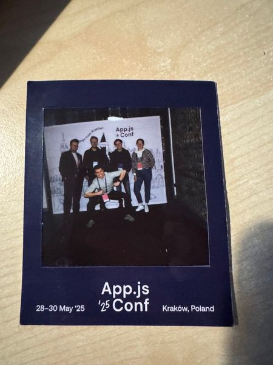

import MuxVideo from '../../components/mdx/MuxVideo.astro';

I joined the Sporting Life team to help them migrate their native apps (Kotlin and Swift) to React Native. Around 3 - 4 thousand users per month consume the native apps and use it to keep up to date with the latest sporting news, statistics and advice. The company prides itself on providing polished and informative experiences.

## Why migrate?

The company had a few issues with the existing native apps. These were:

- Overhead of maintaining two codebases
- Feature drift between both platforms
- Inability to share code with the flagship website which handles over 1 million users a month (Next.js)

Because of the issues mentioned above and the need for a business-critical project that was in the works (required both web and mobile app support), the team decided to move to React Native

They wanted:

- One codebase to rule them all - for faster iteration and less developer frustration over having to maintain two codebases
- Feature parity across platforms
- The ability to write React code but have the ability to drop down and write native modules where needed

React Native was the perfect choice for this.

## Starting at sporting life

I Joined SportingLife in January 2025 as a full stack developer. The React Native project was the first project I was put on. In addition to one other in house developer, I had the pleasure of collaborating with Software Mansion who SportingLife hired to help us instill best practices into the project and to maintain a fast development speed. So in total we had 2 - 3 Software Mansion developers and 2 in-house developers to drive this project forward.

## The migration approach

Since the native apps were quite old and weren't up to date with the latest Swift/Kotlin versions, we decided to do a 'big bang' rewrite, where we took care of small bugs on the native apps as they occured and focussed the rest of our efforts into building the apps from scratch.

**Process**:

- **Requirements freeze** - we froze feature development on the native apps and fully focussed on the rebuild. New features would only be added to the old apps if 100% necessary (API deprecations etc.)

- **Redesign** - Since it had been a long time since the native apps got design input, we received a new design system from our design team, which we implemented with `unistyles` to build solid primitives and components that could be re-used throughout the app.

- **Type Safety** - Unfortunately the website and APIs are written in pure JavaScript so we couldn't simply copy and paste the types from another project that the app needed to consume. To combat this, we hand rolled our own types, utlitised things such as generics and discriminated unions to build a strong contract between the app and what the API returned.

- **Core libraries re-added** - The old apps utilised SDKs such as firebase for notifications, feature flagging and in app messaging. We reimplemented these core behaviors and utilities to work in the new app

- **Unit / e2e testing** - To ensure we didn't run into any regressions and we didn't make any mistakes in the new app, we relied heavily on unit tests (Jest) and e2e tests (Maestro) to ensure the app met stakeholder and user expectations

## Challenges we faced

### Wide API responses

IIf you’ve worked with sports APIs before, you’ll know that the data returned can change depending on many factors. Let’s use horse racing as an example: during a race, events like non-runners, fallers, stewards’ inquiries, changes in odds, and photo finishes can all affect the API’s response. Because of this, we quickly realized that the TypeScript types we had written were inaccurate. To address this, we used generics to determine which type to apply based on the current state of the race. For example we can use a generic to describe if the race is in the past or future, which affected the responses returned from the APIs:

```typescript
type TimeVariant = 'IN_THE_PAST' | 'IN_THE_FUTURE';
type Race<TTimeVariant extends { time: TimeVariant }> = {
  /**
   * @example "Cheltenham Festival race!"
   */
  title: string;

  /**
   * @example "Cheltenham"
   */
  course: string;

  /**
   * @example "13:30"
   */
  time: string;

  /**
   * @example "Cheltenham, UK"
   */
  location: string;
} & (TTimeVariant['time'] extends 'IN_THE_PAST'
  ? {
      status: 'SCHEDULED';
      status_description: string;
      results: [];
    }
  : {
      status: 'FINISHED';
      status_description: string;
      results: {
        horse_name: string;
        position: number;
        time: string;
        jockey_name: string;
        trainer_name: string;
        owner_name: string;
        odds: string;
      }[];
    });
```

### Performance tuning

Rendering large amounts of sports data meant we had to be careful in several areas when implementing new components or adding new data points. We used [FlashList](https://shopify.github.io/flash-list/) over the default `FlatList` which uses virtualisation which isn't the most performant. Instead `FlashList` uses a cell-recycling strategy, which keeps a fixed pool of your components in memory. And so when we scrolled the sports data out of view, it reused that same component (which didn't cause an unmount) just with different data:

<MuxVideo
  playbackId="X7W1lodzJWhO9Qeno6I9lqrBhFWQ3d00NxiEeW8tjCJA"
  caption="Video demonstration of the scrolling behavior"
/>

### Time pressure

A full rebuild meant months without seeing results or new features, which tested the patience of key stakeholders. Thankfully we kept up a fast development pace without sacrificing quality and have succesfully delivered a full rewrite of the native apps with additional features in just under 9 months 🚀

## store transitions

- We had to make sure our app store/play store configuration was correct and users could smoothly install the new React Native app without having to do anything. This included handling things like migration of storage and notifications problems, which required us to implement native modules for IOS and Android to handle the migration of preferences to the new app

### Wins

- One codebase for all platforms
- Faster iteration - we can release daily, using deployment techniques such as over the air updates powered by EAS (expo application services) to quickly release new features and bug fixes
- Consistent experience - users get the same feature set whether they are on Android or IOS
- Future flexibility - the door is open for sharing code, deploying the app to web etc.

Go checkout the apps!

- [Apple](https://apps.apple.com/gb/app/sporting-life-news-results/id1345907668)
- [Android](https://play.google.com/store/apps/details?id=com.sportinglife.android&hl=en_GB&pli=1)

### Conclusion

A big bang migration requires strong buy in from stake holders and commitment in the team - freeze scope early, stick to it and maintain a fast development pace so you can constantly present the progress made to stakeholders. It may not be the correct approach for your project (you may want to consider brownfield integrations), but it worked out well for us.

Finally - I want to say a big thanks to the [Software Mansion](https://swmansion.com/) team who made working on this project amazing, their knowledge and attitude on this project was amazing and its safe to say the company and its developers are very happy with the end result. We had the pleasure of meeting and collaborating with them over in Poland while visiting for [App.js 2025](https://appjs.co/)


